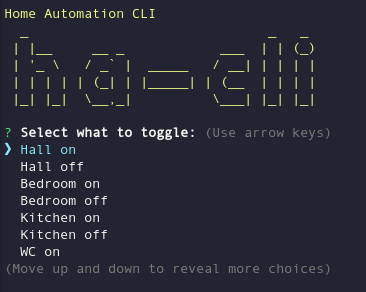

# ha-cli

home automation CLI



## what

This project is a simple wrapper for IFTTT which connects to SONOFF devices and allows to control them via CLI.

## why

To control SONOFF devices there is only app for phone ([eWeLink](http://www.ewelink.cc/en/)). This project allows you to control via CLI.

## how

### prerequisites

1. First create account on [IFTTT](https://ifttt.com).

2. Next turn on [webhooks](https://ifttt.com/maker_webhooks) in IFTTT.

3. Then configure your applets in [IFTTT](https://ifttt.com/create). Search for `webhooks` when creating `this` statement and search `ewelink` when creating `that` statement (in my case I selected "Turn 1 Channel Switch on or off").

4. To obtain webhook url go to [IFTTT webhooks](https://ifttt.com/maker_webhooks) and click `Documentation`.

5. Test connection with presented url and as `{event}` use event name created in step 4. You should be able to switch on/off the light when executing this url.

### installation

Clone repository and cd into:

```sh
git clone https://github.com/Kyczan/ha-cli.git
cd ha-cli
```

Next grab your API key [here](https://ifttt.com/services/maker_webhooks/settings). Save this in `.env` file in root directory of this project (or use existing `.env.example` file):
   
```sh
API_KEY="your_api_key"
```

Then adjust `config.json` file accordingly to your `{events}` values.

And finally install this package globally by typing in terminal:

```sh
sudo npm install -g
```

Now you have command `ha-cli` available across all terminals.

### usage

Open terminal, type `ha-cli`, and follow instructions.
